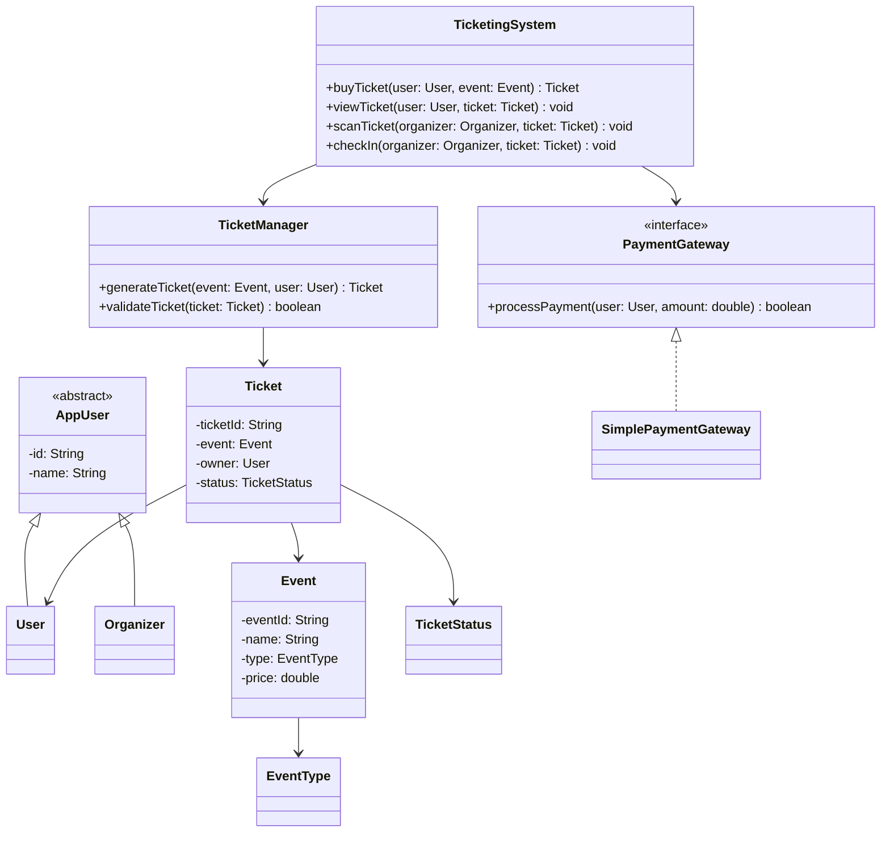

# Exercise 4 - Ticketing System Diagram

```mermaid
classDiagram
class AppUser {
  <<abstract>>
  -id: String
  -name: String
}
class User
class Organizer
AppUser <|-- User
AppUser <|-- Organizer

class Event {
  -eventId: String
  -name: String
  -type: EventType
  -price: double
}

class Ticket {
  -ticketId: String
  -event: Event
  -owner: User
  -status: TicketStatus
}

class TicketManager {
  +generateTicket(event: Event, user: User) Ticket
  +validateTicket(ticket: Ticket) boolean
}

class TicketingSystem {
  +buyTicket(user: User, event: Event) Ticket
  +viewTicket(user: User, ticket: Ticket) void
  +scanTicket(organizer: Organizer, ticket: Ticket) void
  +checkIn(organizer: Organizer, ticket: Ticket) void
}

class PaymentGateway {
  <<interface>>
  +processPayment(user: User, amount: double) boolean
}

class SimplePaymentGateway
PaymentGateway <|.. SimplePaymentGateway

TicketingSystem --> PaymentGateway
TicketingSystem --> TicketManager
TicketManager --> Ticket
Ticket --> Event
Ticket --> User
Event --> EventType
Ticket --> TicketStatus
```
